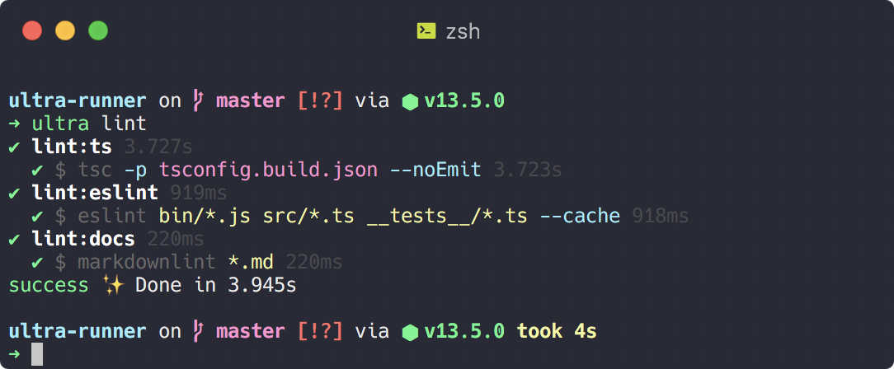

# :runner: :mountain: Ultra Runner

[](https://github.com/folke/ultra-runner/actions?query=workflow%3A%22Node+CI%22) [](https://coveralls.io/github/folke/ultra-runner?branch=master) [](https://www.npmjs.com/package/ultra-runner) [](https://github.com/folke/ultra-runner/blob/master/LICENSE) [](https://github.com/folke/ultra-runner/) [](https://renovatebot.com)

**Ultra fast** monorepo script runner and build tool.

## :sparkles: Features

* **zero-config**: works out of the box with your existing monorepo
* **non-intrusive**: no need to make any changes to your packages.json files
* **workspaces**: detects packages in existing `lerna`, `yarn` and `pnpm` workspaces, or recusrively searches them
* **ultra fast builds**: `ultra` keeps track of file changes in your repo and only actually `build` a package when needed
* **parallel builds**: `ultra` builds your packages concurrently by default
* **workspace dependencies**: workspace dependencies are automatically resolved and used for parallel builds
* **execute anything**: one command to run package scripts, `node_modules` binaries or system binaries, recursively in your repository.
* **faster script execution**: `ultra` hijacks any `npm`, `pnpm`, `yarn` and `npx` calls for faster execution.
* **concurrency within scripts**: you can add optional configuration to `package.json` to run parts of a script in parallel. No need to change the actual `scripts`
* **filtering**: filter on package names or subdirectories
* **output zooming** when executing multiple commands in parallel, `ultra` will try to keep as much concurrent output on the screen as possible, by only showing the last lines of the commands. Once the commands complete running, a full log is written to the terminal. This is very useful when building a bunch of packages with `--watch` for instance.
* **missing scripts** when executing scripts recursively, only packages that have the script defined, will execute it.


## Workspaces

## :nerd_face: Smart

**Ultra** parses your `package.json` and hijacks any `npm run`, `yarn` and `npx` calls.
Shell operators like `&&`, `;` and `||` are also interpreted.

For example:

```json
{
  "scripts": {
    "lint": "yarn lint:ts && yarn lint:eslint && yarn lint:docs",
    "lint:eslint": "npx eslint bin/*.js src/*.ts __tests__/*.ts --cache",
    "lint:docs": "npx markdownlint README.md",
    "lint:ts": "npx tsc -p tsconfig.build.json --noEmit",
    "lint:fix": "yarn lint:eslint --fix"
  }
}
```

Running `ultra lint`


Running `ultra lint:fix` will spawn exactly **one** child process, directly with the correct command, instead of spawning `yarn` intermediately

**Ultra** will additionally execute any configured `pre` and `post` scripts, just like `npm run` and `yarn run`.

## :palm_tree: Recursive Execution

When using `-r` or `--recursive`, the command will be executed in every package of your repository, **excluding the root package**. If you also want to run in the root package, combine `--recursive` with `--root`.
Commands are always run concurrently with a default concurrency of `10` (can be changed with `--concurrency`)

**Ultra** finds packages based on your monorepo workspace:

* lerna
* pnpm
* yarn workspace
* when no monorepo manager was found, we look recursively for packages

Use `--filter <filter>` to filter packages in the workspace. The filter argument can use wildcards to filter package names and/or subdirectories:

```shell
$ ultra -r --filter "@scope/app" pwd
...

$ ultra -r --filter "@scope/*" pwd
...

$ ultra -r --filter "apps/*" pwd
...
```

## :package: Builds

`Ultra` automatically detects workspace dependencies, while still allowing parallel builds. Packages are build concurrently as soon as their dependencies are build (also concurrently).
Every package directory contains a `.ultra.cache.json` file that contains hashes of all files and build artifacts in your repository. Internally this uses `git ls-files` for files under source control and simple `mtime` timestamps for build artifacts.
When building a package, the current state is compared with the `.ultra.cache.json`. Builds are skipped when no changes were detected.

Optimized builds using the dependency tree and files cache, are automatically triggered when running the `build` script or using `--build` with a custom script or command.

All commands below will trigger optimized builds.

```shell
$ ultra -r --build
...

$ ultra -r build
...

$ ultra -r --build mycustombuildscript
...
```

If for some reason you want to rebuild a package, use `--rebuild` or `rebuild`.

## :zap: Fast

**Ultra** parses your `package.json` scripts and will only execute the commands that are really needed. Any script interdependencies are resolved during the parsing stage.
This ensures there's pretty much no overhead in execution by **Ultra** itself, since it's only running once.
`yarn run` or `npm run` on the other hand, will spawn new `yarn` or `npm` child processes as needed by the package scripts.

|                          | `npm run`          | `npx`              | `yarn`             | `yarn exec`        | `ultra`            |
| ------------------------ | ------------------ | ------------------ | ------------------ | ------------------ | ------------------ |
| `package.json` scripts   | :white_check_mark: | :x:                | :white_check_mark: | :x:                | :white_check_mark: |
| `./node_modules/.bin/`   | :x:                | :white_check_mark: | :white_check_mark: | :white_check_mark: | :white_check_mark: |
| system binaries          | :x:                | :white_check_mark: | :x:                | :white_check_mark: | :white_check_mark: |
| execution overhead _(1)_ | 250ms              | 60ms               | 220ms              | 200ms              | 65ms               |

  <!-- markdownlint-disable MD033 -->

> <sup>**1.** each program was run 10x with the command `true` or `{scripts:{"true":"true}}` to calculate the execution overhead</sup>

Suppose you would want to run a script that calls 5 other scripts by using `&&` and/or `post`/`pre`.

* Using `yarn`, you would have a total overhead of **2.5s** _(10x 250ms)_
* Using `ultra`, you hit the overhead only once, so the total overhead would still be **65ms**

To make execution **ultra** fast, you can [configure](##gear-optional-configuration) which `scripts` should be ran concurrently.

> :grey_exclamation: there's no need to **switch** your scripts over to **ultra**. Even with the optional configuration you can still use `yarn` or `npm` to run your scripts if you want to.

Example builds:

|                                                             | `yarn` | `ultra` not concurrent | `ultra` concurrent |
| ----------------------------------------------------------- | ------ | ---------------------- | ------------------ |
| build [Ultra-Runner](https://github.com/folke/ultra-runner) | 8.9s   | 7.2s                   | 5.1s               |
| build [Devmoji](https://github.com/folke/devmoji)           | 16s    | 13s                    | 8s                 |

## :art: Formatting

There are three output formats that each can be combined with `--silent` to hide command output.

`--pretty` is the default. It shows output in a hieracrhical way and uses spinners to see exactly what's happening.
Make sure to check out the animation at the top of this page. Every executed step shows the execution time.

`--pretty` combined with `--silent` is useful if you're only interested to see the overview:

`--no-pretty` doesn't use spinners and prefixes command output with the command name. This is useful for logging purposes.

Combining `--no-pretty` with `--silent` shows a flat overview.

`--raw` will show the exact ouput as you would expect when running the commands stand alone. If the command you're executing is interactive (reads from stdin), then this is the mode you should use.

## :dizzy: Getting Started

Install with `npm` or `yarn`

> globally

```sh
npm install -g ultra-runner
yarn global install ultra-runner
```

> locally inside your project. use with `npx ultra`

```shell
npm install --dev ultra-runner
yarn add --dev ultra-runner
```

Now run `ultra --info` within your repository to see everything related to your monorepo

See [optional configuration](##gear-optional-configuration) for information on how to setup concurrent script execution.

## :rocket: Usage

```console
$ ultra --help
Usage: ultra [options] <cmd> [cmd-options]

Workspace:
  --recursive, -r  Run command in every workspace folder concurrently                                      [boolean]
  --filter         Filter package name or directory using wildcard pattern                                  [string]
  --root           When using --recursive, also include the root package of the workspace                  [boolean]
  --concurrency    Set the maximum number of concurrency                                      [number] [default: 10]

Status:
  --info  Show workspace dependencies                                                                      [boolean]
  --list  List package scripts. Also works with --recusive                                                 [boolean]

Build:
  --build, -b  Use dependency tree to build packages in correct order                                      [boolean]
  --rebuild    Triggers a build without checking for file changes                                          [boolean]

Formatting:
  --pretty  enable pretty output, spinners and seperate command output. Default when a TTY [boolean] [default: true]
  --raw     Output only raw command output                                                                 [boolean]
  --silent  Skip script output. ultra console logs will still be shown                                     [boolean]
  --color   colorize output                                                                [boolean] [default: true]

Options:
  --version      Show version number                                                                       [boolean]
  --dry-run, -d  Show what commands would be executed, without actually executing them                     [boolean]
```

## :gear: Optional Configuration

To allow parallel execution of your scripts, you can specify scripts that should run concurrently,
in your `package.json`.

```json
{
  "scripts": {
    "lint:eslint": "npx eslint bin/*.js src/*.ts __tests__/*.ts --cache",
    "lint:docs": "npx markdownlint *.md",
    "lint:ts": "npx tsc -p tsconfig.build.json --noEmit",
    "lint": "yarn lint:eslint && yarn lint:docs && yarn lint:ts",
    "prebuild": "yarn lint && yarn jest",
    "build": "..."
  },
  "ultra": {
    "concurrent": ["lint"]
  }
}
```

* `yarn build` will run the `lint` and `jest` commands sequentially
* `ultra build` will run all `lint` commands concurrently and then execute `jest`. (note that we can also add `prebuild` to `concurrent`, since tests don't depend on linting. this way all commnands would run concurrently)
